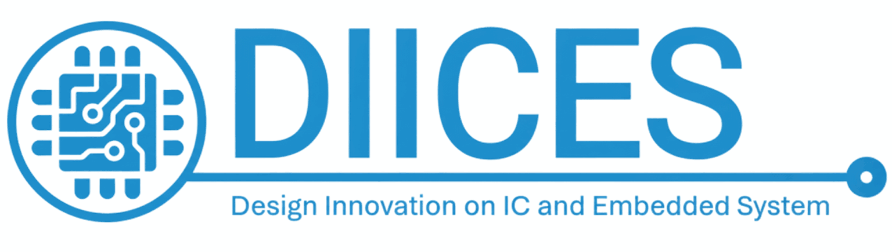

# 🛠️ VLSI IC DESIGN Projetcs With Open-Source Tools adn Technology  (SkyWater 130nm & OpenLane)

A curated portfolio of analog and digital VLSI IC design projects developed using open-source tools and the **SkyWater 130nm PDK**, covering the complete design flow from RTL and schematic design to physical implementation and verification.

---

# 📚 Table of Contents
1. [Introduction](#1-introduction)
2. [Proficiency in VLSI IC Design Tools](#2-proficiency-in-vlsi-ic-design-tools)
3. [VLSI IC Design Projects Summary](#3-vlsi-ic-design-projects-summary)

---

# 1. Introduction

I am an Electrical Engineering student specializing in **analog and digital VLSI IC design**, 
with hands-on experience using **open-source EDA tools** and the **SkyWater 130nm technology**. 
I am a member of the **DIICES research group (Design Innovation on IC and Embedded Systems)**.

This repository showcases a curated portfolio of **end-to-end VLSI IC design projects**, 
covering schematic and RTL design, physical implementation, and verification workflows.

---

# 2. Proficiency in VLSI IC Design Tools

| Tools | Function |
|------|----------|
| **Xschem** | Schematic capture & netlist generation | 
| **Ngspice** | SPICE simulator | 
| **Magic** | VLSI layout editor | 
| **Netgen** | LVS (Layout vs. Schematic) | 
| **Irsim** | Digital Simulator | 
| **Docker** | Container platform |
| **KLayout** | Layout viewer | 

---

# 3. VLSI IC Design Projects Summary

This section provides a concise overview of the VLSI IC design projects

| Project | Description | Link |
|------|----------|--------|
| **Inverter** | CMOS inverter design using Xschem and Magic VLSI with LVS verification, testbench simulation, and Verilog-to-layout implementation via OpenLane. | 🔗 [Repo](https://github.com/raisrmdhnar2/VLSI_Inverter_Design) |
| **4 Bit Down Counter** | 4-bit down counter designed in Verilog, implemented through OpenLane, and verified using IRSIM. | 🔗 [Repo](https://github.com/raisrmdhnar2/VLSI_4Bit_Down_Counter) |
| **4 Bit Shift Register** | 4-bit shift register implemented in Verilog, synthesized and physically realized using the OpenLane flow, with functional verification performed through IRSIM simulations. | 🔗 [Repo](https://github.com/raisrmdhnar2/VLSI_4Bit_Shift_Register) |
---

THANK YOU

